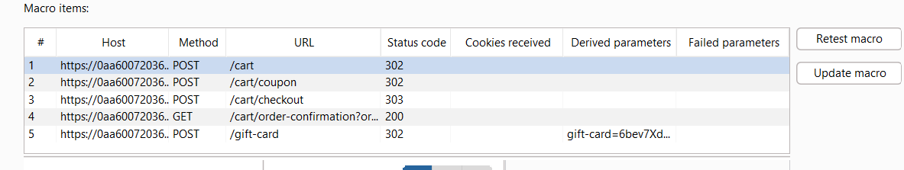
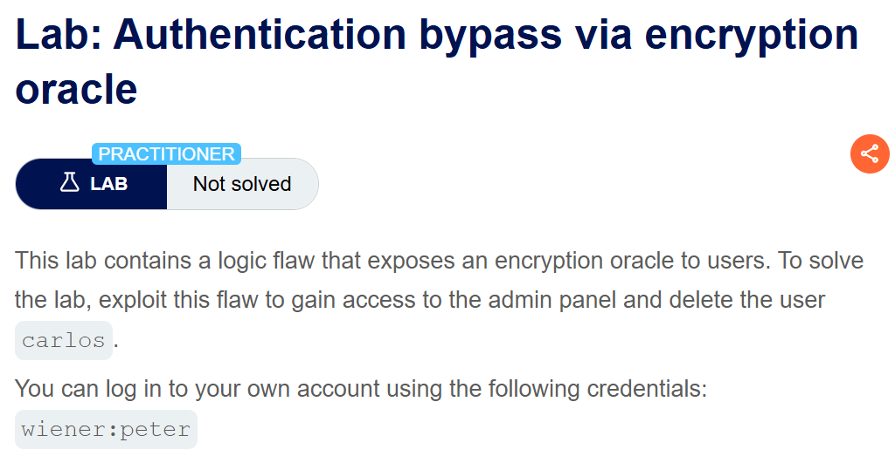

**Step1:**

Login with given credential

**Step2:**

View first product  leather product and add it to card but keep in mind to on intercept


**Step3:**

Change the price to 1 and forward

**Step4:**

Go to cart


And we can see the price is 0.01


Click on place order and lab is solved
  


**Step1:**

Login with given credential

**Step2**

Click on view product , then add to stock


Click on any product other the jacket in my case I click on 4th product padding pool shoes
.
And add to stock


Now add jacket to cart as well

**Step3:**

Notice the total price is


Now when I add padding shoes to negative the price value decrease
 ,


So we decrement it until the value is less then 100 and then place order  


And click on place order to solve the lab


This lab is basically an integer overflow

Understanding Integer Overflow

Integer Overflow occurs when an arithmetic operation attempts to create a numeric value that is outside the range that can be represented with a given number of bits. In many programming languages, integers have a fixed size (e.g., 32 bits), which means they can represent a finite range of numbers. For a signed 32-bit integer, this range is typically from -2,147,483,648 to 2,147,483,647.

When an operation results in a value greater than 2,147,483,647, it "overflows" and wraps around to the minimum value of -2,147,483,648. Similarly, underflow can occur when a value falls below the minimum range, wrapping around to the maximum value.

**Step1:**

Login with given credential

**Step2:**

Add leather jacket to cart


**Step3:**

Now we send Post /cart request to repeater


When I change price to 100 it show


**Step4:**

Send the request to intruder and select null payload and quantity to 99


Payload setting


With this payload we have negative value

Explanation

 if I select the continue indefinitely we can clear notice the value is continuously positive and negative because of over flow

**Step5:**

Go to repeater and select quantity to 47 and send


Now we have negative value near to -1221


**Step6**

Select any product and order it so the the value set between 0 and 100


Click on place order to buy


**Step1:**

Register account  


The id is of my email server


**Step2:**

If we directly access to admin panel it show message admin panel is only accessable if login as 

**Step3:**

Now we update email address to

`anything@dontwannacry.com`


And now I have access to admin panel  


Delete user carlos


Vulnerability:

Email Truncation Vulnerability:

    • When a user registers with an email address that is exceptionally long, the application server truncates the email address to 255 characters. This is likely due to a database or application-level constraint on the maximum length of email addresses.

    • The user exploits this behavior by crafting an email address such that the part before the truncation point appears to belong to a privileged domain (e.g., dontwannacry.com). As a result, the truncated email address looks legitimate, potentially bypassing domain checks or gaining elevated access.  

**Step1:**

First we register account having email address, containing number of dummy character like

`dummycharacter@email server-id`


When I go to my account we can see  


Here email address is 255 char log

**Step2:**

If we go to /admin we can see admin interface is only available for DontWannaCry user


**Step3:**

Now I make an email

`Anything@dontwannacry.com.emailclint` id

The size of anything till .com should be 255 char  

In my case

```
DontWannaCDontWannaCDontWannaCDontWannaCDontWannaCDontWannaCDontWannaCDontWannaCDontWannaCDontWannaCDontWannaCDontWannaCDontWannaCDontWannaCDontWannaCDontWannaCDontWannaCDontWannaCDontWannaCDontWannaCDontWannaCDontWannaCDontWannaCcccccccc@dontwannacry.com
```
  
My email address

```
DontWannaCDontWannaCDontWannaCDontWannaCDontWannaCDontWannaCDontWannaCDontWannaCDontWannaCDontWannaCDontWannaCDontWannaCDontWannaCDontWannaCDontWannaCDontWannaCDontWannaCDontWannaCDontWannaCDontWannaCDontWannaCDontWannaCDontWannaCcccccccc@dontwannacry.com.exploit-0afe00dd037e2131811cd89801f80040.exploit-server.net
```

Now when I log in my account I am an admin user


Delete user carlos


**Step1**

login with given credential


**Step2:**

Change password and send the POST /my-account/change-password request to repeater.


**Step3:**

Change the username to administrator


**Step4:**

Remove current password parameter and send request


**Step5:**

Login to administrator user and delete user carlos


**Step1:**

Login with given credential


**Step2:**

Check the normal work flow

Add an item of less price. In my case I have buy a product for testing that’s why credit is decrease.

Now I brough a product like


**Step3:**

Add this item to cart.

**Step4:**

Click on place order and intercept request


We have this request


Forward


Now we note this

GET /cart/order-confirmation?order-confirmed=true

And after confirmation we have product


**Step5:**

Now we add jacket to stock and change error message with the above request

We have intercept place order request  


Change it to


And forward the request.


And lab is solved.


**Step1:**

Go to /admin request


So it is only accessible if we logged in as admin.  

**Step2:**

Login with given credential and intercept this request


**Step3**

Login to account we see it is asking for role


Logout and then intercept the login request

We have intercepted request


Forward the request

Now click on drop to drop next request


When I drop this it show error in browser


Remove the /role-selector from the url and again click on enter


Now forward this request and turn off intercept


Now we go to admin panel and delete carlos.


**Step1:**

Login with given credential

**Step2:**

We can see at top


**Step3:**

Now go to bottom and we have signup

Enter any email address


Click on signup

 

Now we have multiple coupen NEWCUST5 and SIGNUP 30
  
**Step4:**

Add leather jacket to stock

First we enter coupen1 and then coupen2.

Here we can clearly see that when we enter first coupon and then enter the second one it will not give an error. But i use same coupon multiple time it say that coupon is already used.

Now when I use both the coupon alternatively it will not show an error and the price decrease on the basis of coupon


**Step1**

Login with given credential


Now we paste the email in home -> input box at bottom

`wiener@exploit-0a6e0006034e355d8157ba0c01b70082.exploit-server.net`


Click on signup we have


Now add a card to cart and apply coupon we have


Click on place order 


**Step2:**

Now go to my-account page and paste the code for redeem and we have 


It means that it is not redeem the discount it is redeem original price of product

**Step3:**

Now we do this step continously to make the 1000 dollar to buy jacket for this we create a macro base on the request chaining


Now the highlight are the request flow

```
POST /cart
POST /cart/coupon
POST /cart/checkout
GET /cart/order-confirmation?order-confirmed=true
POST /gift-card
```


**Step4:**

Under `Proxy->proxy Setting->sessions`


Now add a macro with the above sequence


**Step5:**

Now we make couple of changes

First we have code in 

`GET /cart/order-confirmation?order-confirmed=true` which is used for redeem 

Click Configure item. In the dialog that opens, click Add to create a custom parameter. Name the parameter gift-card and highlight the gift card code at the bottom of the response. 


Click ok and then ok


1. Select the POST /gift-card request and click Configure item again. In the Parameter handling section, use the drop-down menus to specify that the gift-card parameter should be derived from the prior response (response 4). Click OK.


Set gift card from previous response


Now click on test macro to test



Now when we refresh page the macro is working correctly

**Step6:**

Now make few change

Again click on session
    


Go to session handling rule

Add a rule 


Under scope add all url


Under detail add a rule action name "run a macro" and select a macro


Click on ok


**Step7**

Now we have to continuously execute macro to increase price

Send a request to intruder let my-account and attack to snipper and payload to null


Payload setting


In resource pool we create new resource pool with max concurrent request 1


Under logger tab we can see macro is working correctly


It may take time because in one request we are sending 5 request


Finally when we refresh page we have enough money to buy a jacket



**Step1:**

Login with given credential and check the stay log in box


**Step2:**

Go to any post and post with incorrect email


We have an invalid email address


**Step3:**

Send the POST /post/comment and GET /post?postId=4 repeater


The get request


Here we can see that the response notification of POST request is set as notification cookie in GET request.

Here in GET  response we have


**Step4:**

Now when we change the email in post request 


Now when we paste the notification in get  request notification we have


**Step5:**

When we paste the value of stay logged in in notification we have


Now in POST /post/comment change email with administrator:time-stamp in my case administrator:1737514757171

And send request


Copy the notification and paste it in GET request we have


Now here the length of Invalid email address: is 23 character we have to remove it 

Now we send the notification to burp decoder and decode it url follow by decode base 64


Select 23 byte from decoded notification right click and remove

Again base encode and then url encode


Paste it in GET request notification


**Step6:**

Now here the length should be multiple of 16

For this we send a post request with email value


Again copy paste the notification value from response in get request


Now here invalid email till 'a' is multiple of 16 ie.32 character

Invalid email address: qqqqqqqqq


Now again send the notification value to decoder and remove first 32 character


Again encode and base 64 follow by url encode


Here we can see we the notification cookies is ok for admin

Send the GET request to repeater and change endpoint to /admin

Delete the session cookie entirely, and replace the stay-logged-in cookie with the ciphertext of your self-made cookie. Send the request. Observe that you are now logged in as the administrator and have access to the admin panel.


Send a get request to 


And lab is solved
