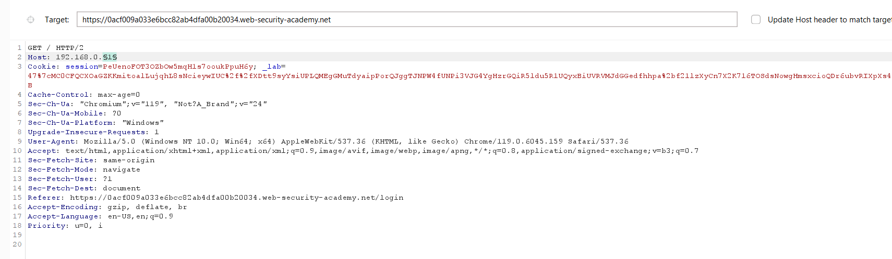
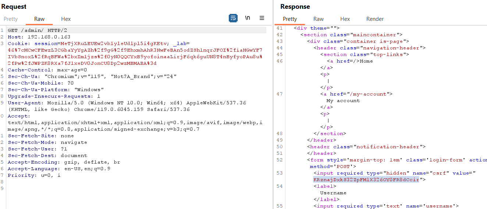
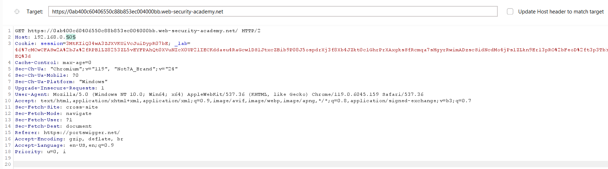

**Step1:**

Try to login with any credential


**Step2:**

When we type in url /admin it say 


**Step3:**

Send the POST login request to repeater and change host to local host
Host: localhost


Now we try to get /admin request and change host to local host
Got to proxy tab and in http history search for /admin request and send it to repeater


**Step4:**

Now we delete user using post request
Right click and change method to request method.

Add this /delete?usernname=carlos


And the lab is solved.


**Step1:**

On login page Click on forgot password

**Step2:**

Go to email client and update password


**Step3:**

Send the POST /forgot-password request to repeater
We can see in request we have 


We have  password reset token.

**Step4:**

Again go to forgot password and this time use username carlos 
In request change the Host to exploit server id.


**Step4:**

Now when we access logs we can see


**Step5:**

Now go to repeater and instead of your password reset token use that of carlos


Send the request.

Now simple login with username carlos and password peter and the lab will solved.


**Step1:**

Go to lab.

**Step2**

Send the GET/ request to repeater

**Step3:**

Here when I add a parameter in get request it shows


In response we see the X-cache is miss because the search query is not found
But when I again send the same request


The result show cache hit.it mean previous get request is present in cache

**Step4:**

Now when I add additional host below the main host. We can clearly see in response the 


Here we can see the host is set to second request.

And the endpoint for home get request is resources/js/tracking.js


**Step5:**

Go to exploit server and add file


In content write


And store the exploit.

**Step6:**

Now we go to repeater and set the second host to exploit server.


Now when we send the request the lab will solve.


**Step1:**

Turn on the intercept and refresh home page.
 


**Step2:**

Send the request to repeater and replace the host with Collaborator id


In collaborator we have

 

From here one thing is 
Clear that we make the website's middleware issue requests to an arbitrary server.
 
**Step3:**

Now send the request to intruder and replace host withip provided by Lab. Add the last part of ip.
 



Here keep one thing that the **update host header to match target** check box is not checked. As shown in above figure.
 
In payload setting we use number payload from 1 to 255 with increment of 1
 

 
In response we can see one ip with error response 302


 
The reponse show it is an admin page.
 
 
**Step4:**

Now we set Host to that ip address and send get request to delete user carlos
 
But before this send request and in response we have csrf we will copy it
  


**Step5:**

Simply send the request to delete user carlos
 


And the lab is solved.
 


**Step1:**

Send the get request to repeater
 


**Step2:**

Here when we send get request to home page using GET method we can still se the home page

```
GET https://0ab400c60406550c88b853ec004000bb.web-security-academy.net/ HTTP/2
Host: 0ab400c60406550c88b853ec004000bb.web-security-academy.net
Cookie: session=3MtKIiQ34wA3ZJXVKUiVcJuiDypR07bE; _lab=46%7cMCwCFASw2A%2bJa%2fRPBlLZ8253ZL5vEYFPAhQt0XVuNIcX0UP2lIECKddaeu4RaGcwlDSlJtxcZBib9P08J5ospdrXj3f8Xb4JZkt0c1GhrPrXAxgksSfRcmqa7sHgyrRwimADzscSidNcdMo4jPs1ZLkn9Erl3pRO%2bFeoD%2ft3p3TbhEQ%3d
```
**Step3:**

So we access home page using GET method and set the Host to collaborator id


 
Now when we go to collaborator we can see interaction
 


**Step4:**

Now again we replace host with the ip provide by lab `192.168.0.0` and send it to intruder
 
In intruder we set payload for the last 0 because we know according to CIDR notation /24 mean last 255 is assignable
 


Here keep one thing that the “update host header to match target” check box is not checked. As shown in above figure.
 
We set payload to
 


In response we can see
 


Now send it to repeater 


 
At /admin we can see the csrf token. Now we copy it and send a get delete endpoint with csrf and username parameter
 

 
And the lab is solved.


