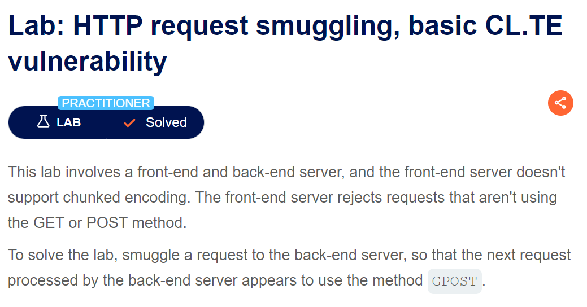

To solve the Request smuggling Lab the best approach is

```
  1.Downgrade http protocol to http 1.1
  2.change request method to post
  3.Disable automatic update of content length
  4.show non printable character
```

To solve the lab first we understand how Transfer-Encoding: chunked work

When using chunked transfer encoding, the body of the HTTP message is broken into chunks. Each chunk has two parts:

	-Chunk Size: Specified in hexadecimal, followed by a newline (CRLF).

	-Chunk Data: The actual data for that chunk, followed by another newline (CRLF).

```
<chunk-size-in-hex>\r\n
<chunk-data>\r\n
<chunk-size-in-hex>\r\n
<chunk-data>\r\n
...
0\r\n
\r\n
```
Example:
```
b\r\n
Hello, Worl\r\n
2\r\n
d!\r\n
0\r\n
\r\n
```

• b\r\n: The first chunk is 11 bytes (b in hexadecimal) long.
• Hello, Worl\r\n: The data for the first chunk.
• 2\r\n: The second chunk is 2 bytes long.
• d!\r\n: The data for the second chunk.
• 0\r\n: This chunk size of 0 marks the end of the data.
• \r\n: This extra newline marks the end of the chunked transfer.


**Step1:**


Send the GET request to repeater


**Step2:**

Change method to post and remove unnecessary content


**Step3:**

Change it form http 1.1


Change it to http/1


Turn off the Update content length for this setting button in repeater


**Step4:**

Add \r\n to line by clicking on


• \r (Carriage Return): Moves the cursor to the beginning of the line.
• \n (Line Feed): Moves the cursor to the next line.


**Step5:**

Now we send a payload 

2\r\n
Ab\r\n
3\r\n

I have set the content length to 10 and we set the first chunk to 2  and then next chunk size to 3 but not have a value of chunk so the server take a time in sending response and the response will be time out because of not provided chunk data


**Step6:**

As according to Lab requirment we have to call method GPOST so we use this payload


Here we see the total content length is 21. and after terminating all chunk we send a G

When I again send the same request it will show this message


And the Lab is solved.


Perform some basic step

**Step1:**

Send the GET / request to repeater.

change request method to post


1.Downgrade http protocol to http 1.1
2.Disable automatic update of content length
3.show non printable character


**Step2:**

Now we confirm that the client side is using TE


Here it is confirm that the client size is using TE because for X chunk size which is invalid secondly there is no corresponding chunk data the  server respond with invalid request.

**Step3:**

Now we confirm that the client side is using CL


Here the content length is 14 


Here we can after the termination we have S the server is expecting 14 but the S is not send to backend due to termination from client size and after few wait it show connection time out.

**Step4:**

Now we try with the 


When we again send the same request we have


The reason is that after the termination using 0 from client time the backend is only excepting tell 14 char which is tell G and 0 is not including at backend in next request it is shown.

**Step5:**

To solve this lab we use


When we again send the same request we have successfully call the method G+POST =GPOST


How this work

The first content length is 18 because


Now why 56 is set because the hex value till end of line 14 is 56


The next content length is 6 instead of 5 because when we again call the GET/ method it will know first 18 character till line 11 and include G in next request as 0 in step4


**Step1:**

Send the GET / request to repeater.

**Step2:**

Before moving to solve first we do some step to make it easy to interact.
Change http/2 to http/1.1


Change request method to post and remove unnecessary headers


**Step3:**

Check what is front end accept


The error is due to X and the reason in explained in the previous lab

**Step4:**

Check what is backend accept


Here the backend is also use TE because the last X is ignore. After the byte is complete

**Step5:**

We make this lab like TE.CL because we use 2 header one with original value chunked and second with any other. And send request. The front end will except transfer encoding and the backend is now shift to content length because of not under standing helloworld value as in figure. This may to due to different proxy server or different version of proxy server.


**Step6:**

Now we use the same payload as use in TE.CL lab


**Step7:**

When I again send same request or new GET request it show GPOST issue


```
POST / HTTP/1.1
Host: 0a8400db04dd94f28086ea3b00dd00f7.web-security-academy.net
Priority: u=0, i
Connection: close
Content-Type: application/x-www-form-urlencoded
Content-Length: 18
Transfer-Encoding:chunked
Transfer-Encoding:helloworld

3
abc
1
G
56
GPOST / HTTP/1.1
Content-Type: application/x-www-form-urlencoded
Content-Length: 6

0
```


**Step1:**

This lab is very simplie to previous we have to

**Step2:**

TO solve this lab we use

```
POST / HTTP/1.1
Host: 0a48001304b0738e815803aa00a300f7.web-security-academy.net
Content-Type: application/x-www-form-urlencoded
Content-Length: 49
Transfer-Encoding: chunked

e
q=smuggling&x=
0

GET /404 HTTP/1.1
Foo: x
```

Now when I again send the request or new get it show Not found error


If the attack is successful, then the last two lines of this request are treated by the back-end server as belonging to the next request that is received. This will cause the subsequent "normal" request to look like this:

```
GET /404 HTTP/1.1
Foo: xPOST /search HTTP/1.1
Host: vulnerable-website.com
Content-Type: application/x-www-form-urlencoded
Content-Length: 11
q=smuggling
```


I have directly share the solution because it is similar to previous lab. The length of content is 4 because of 5e\r\n
And the size of chunk data is 5e because of 


And the last content length is et to 15 but it must be greater than or equal to  content length +1 so as content length is 10  as shown below so the content length can be 11 or any other we set it to 15


**Step1:**

First we do some initial Step 

Send remove unnecessary parameter and change request method to post and Change http protocol t http/1.1


**Step2:**

First we check any unknow endpoint by sending request


Now to see result we send normal post request


Now we send GET request to /admin page


When we send normal request we can see that admin is unauthorize


**Step3:**

Now to Get admin we add a host to localhost in next GET admin request


Here when we send the normal request we see an error


The reason for this error is when we send the request  in the body we have another request to /admin
Now when we send then normal request the server treat it as 

```
GET /Admin HTTP/1.1
Host: localhost
POST / HTTP/2
Host: 0a5f00c303eeb9ae81d19e8100390025.web-security-academy.net
Content-Type: application/x-www-form-urlencoded
Content-Length: 5


1=2
```

As it see 2 host header and 2 request so it print message that duplicate header not allows in. even if we add a dummy header like

```
GET /Admin HTTP/1.1
Host: localhost
Newheader:x
```

Still the problem of duplicate header not remove because our request look like

```
GET /Admin HTTP/1.1
Host: localhost
Newheader:xPOST / HTTP/2
Host: 0a5f00c303eeb9ae81d19e8100390025.web-security-academy.net
Content-Type: application/x-www-form-urlencoded
Content-Length: 5
```

Still we have 2 Host header.

**Step4:**

Now we send this request


Now when we send simple request we are able to access the admin


Now the reason is when we send

```
POST / HTTP/1.1
Host: 0a5f00c303eeb9ae81d19e8100390025.web-security-academy.net
Content-Type: application/x-www-form-urlencoded
Content-Length: 125
Transfer-Encoding: chunked

0

GET /Admin HTTP/1.1
Host: localhost
Content-Type: application/x-www-form-urlencoded
Content-Length: 13

appendhost=
```

The content length of second request is set to 13 at minimum it should be body +1 it means the request must be at least 12.
The idea is to make the next request look like
appendhost=Host: 0a5f00c303eeb9ae81d19e8100390025.web-security-academy.net so the duplicate header problem is remove


**Step5:**

Simply delete user carlos


When we again send the request the lab will solve


**Step1:**

The approach to solve this lab is very similar to the previous lab the only difference is that the front end is YE and backend is CL

First we do some initial Step 
Send remove unnecessary parameter and change request method to post and Change http protocol t http/1.1


**Step2:**


Now we know that front end is TE so we use correct chunk size and data. The 2a is chunk size of 2 line after that line ie GET and Content.

The content length is important in second request and it must be at least content length +1 in order to link with next request

When we send the normal request we see 


**Step2:**

Now the other step are same only we set the chunk size 


And here we are not authorize


**Step3:**

Adding a host:localhost


And in normal request we can see admin page is accessible


**Step5:**

Now we simply delete user carlos


Send a normal request to delete user


**Step1:**

In this challange when se search something in search bar it will show in response in a tag


And second when we access the admin page it show


**Step2:**

Send the GET / request to repeater and remove unnecessary header

**Step3:**

When we use this payload it take too much time


And it is explain earlier that this payload is used for CL.TE vulnerability.

**Step3:**

Now when we try to access the admin page it show


In the next normal request it show unauthorize


**Step4:**

As we know that x-forwarded for header will not work so we try to extract the header use in the app. Fo this we send the post request to / because search functionality with the parameter search and a  value. But this we set the content length to at least 163.


The reason for setting content length to 163 is that when we send a normal search request with all unnecessary header remove the content length is 163.


And we want to extract the header in the next request. If we have not found data in this request we will increase content size.

Now when I send normal search request we have header in response


**Step4:**

Now we access the admin page using this header


In normal request we have


**Step6:**

Now we simply delete the user carlos


In normal request we have


And the lab is solved.


**Step1:**

First we check that user-agent vulnerability. Fist view any post

Here we can see that the value of user agent is store in the input tag


**Step2:**

When we change the value it is show in value attribute


**Step3:**

Try can execute an alert to see the cross site vulnerability


When I refresh the page it show alert

**Step4:**

Final step to solve the lab is to combine the xss with http request smuggling.
For this we use the payload


Now when we refresh the page it will execute the alert.

Here I have skip few step like how I check wether it is CL.TE or TE.CL because it is already explain in other lab. And I think there is no need to explain the payload.


**Step1:**

End the GET / request to repeater.
Change request method to POST and uncheck content length update.


**Step2:**

To check http request smuggling we have


Here after the world we not add endline character because we want next request to append with current.

Now when we send normal request we have


This is because the request is interepret by server as


**Step3:**

Now we send any js file to repeater


When we change the header to 


We can see a redirection is occurring.

**Step4:**

Now when we send POST/ request to this endpoint with a different host


We can see in normal get request we have new host


**Step5:**

Now we change the host to exploit server and make the filename to /resources/labheader/js on exploit server and content type to text/javascript


In body we write


**Step7:**

Send the POST request to exploit server with


In response we have


Note: if now foundthis 302 redirection then again send the previous post request and then this ge and do this until we found redirection. This is because the user access the site after every then second.

We can use intruder as well for this.


**Step1:**

Send the GET / request to repeater.
Change request method to post and remove unnecessary header.


**Step2:**

Add a new header anyname:anyvalue\r\nTransfer-Encoding: chunked


Here after add a newheader but the problem is burp syntax interpretation which is fine.

Before add newheader
```
POST / HTTP/2
Host: 0a5300e8049259638113642900ab006a.web-security-academy.net
Content-Type: application/x-www-form-urlencoded
Content-Length: 40

0

GET /Hello HTTP/1.1
hello: world
```

After add newheader i.e


After sending this request when we send normal request we have


**Step3:**

Now when we search for any value in search bar it show the previous search


Send the request to repeater


Remove unnecessary header


Now we send the post request with this search parameter and header as show above


Here we set the content length to 400 now when we send the normal get request


And refresh the page we have


**Step5**

as we know that user access the ite after 15 second in order to get the user session we send the request with content length to almost 900


After 15 second when we refresh the home page we have


**Step6:**

Copy the session value paste it in inspector application tab->session


And click on my account to solve the lab
