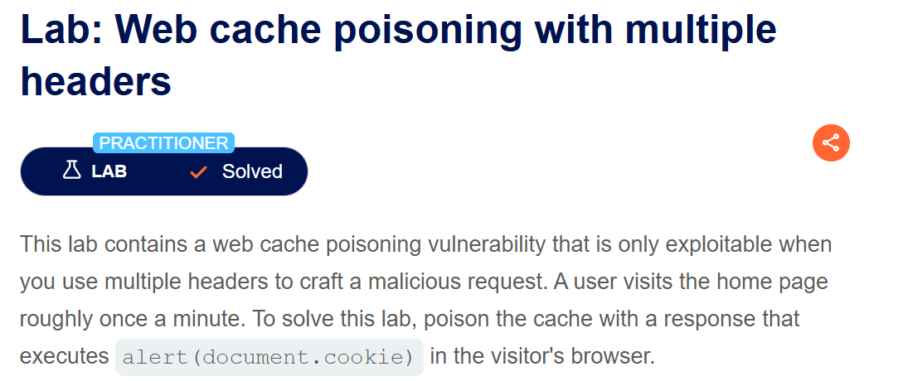
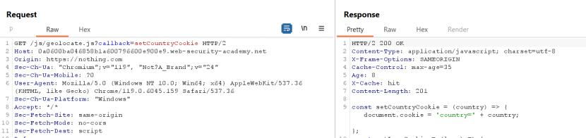
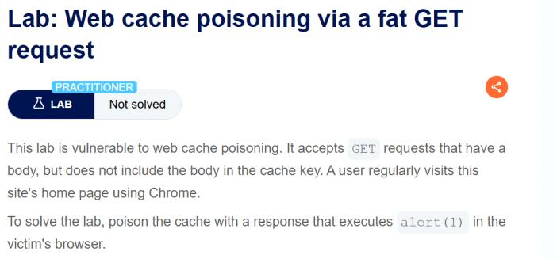

**Step1:**

First we check the end point where we have three headers
```
Cache-Control: max-age=30
Age: 1
X-Cache: hit
```


**Step 2:**

Now we send the request to root / endpoint with a varaible and a value for cache busting


When I again send the same request we have


**Step 2**

We already know X-forwarded-Host header is supported but we can find it using param extension from BApp store

Right click on get request 


**Step 3:**

When I add any host it will be shown in request


**Step 4:**

Now we add exploit server id instead of host


And set the file endpoint to /resources/js instead of exploit

In body we add


Now we remove the cache busting variable and store the exploit


Send the request multiple time to solve the lab. If not go to the main page reload the page it will show an alert and lab will solve


**Step1**

First we check the end point where we have three headers
```
Cache-Control: max-age=30
Age: 1
X-Cache: hit
```


**Step 2:**

Using a cache busting technique add a variable with a value


When again we send the request we have


So cache busting is working

**Step3:**

Here we can see a fehost parameter when I change its value there is no cache hit or miss occur

But when I remove its value in response we have empty string


The json formate is like
```
{"frontend":"value"}
```
To trigger an alert we use

`{"frontend":""value""}`

Our exploit look like

`{"frontend":""-alert(1)-""}`

Change the value of fhost to **-alert(1)-**


When we reload the page the lab will solve



**Step1:**

Send the GET request to repeater

**Step2:**

Add a cache busting variable when we send first time we have


When we again we send again we have


**Step3:**

Now when we use param miner we can see the X-Forwarded-Scheme header is supported


here another header X-forwarded-host is also supported but not trigger here

When we add these two header we can see a redirect


Now we redirect to a specific endpoint first check for /resources/js/tracking.js when we add a header we can see a redirect


**Step4:**

Now we change host with the url of exploit server


And in exploit server we make couple of changes


Now store it and when we send the request again couple of time and refresh the page the alert will trigger and the lab will solve.


**Step1:**

Send the Root endpoint to repeater

**Step2:**

Add a cache busting variable and see the output


When we send the request again we have cache hit


**Step3:**

Now using param miner I found that the X-Host is allowed

Adding X-Host header with a value


**Step4:**

Now we have to get the user-agent because in response we have vary header set to user-agent

For this we add a comment with img tag in body with src is exploit server.


When we post command and see the log we have victim user-agent


Copy this and add it to user agent instead of our own and change X-Host to  exploit server id


Go to exploit server make the below changes and store it


Go to repeater and send the request couple of time or multiple time to trigger.


**Step1:**

Send the Get / request to repeater and add a cache buster 


Here when I change the value there is still cache hit 


So we find some other cache busting point.

Why it is important to find cache busting point.

	1. When we send a reuqest which we want to cache which was not previously cache. Like we again cache same GET request so we add a point where it will make a change
	

**Step2:**

So we find some other cache busting point like Accept, Accept-Encoding and Origin header


Here we can see no difference

So we try with accept encoding


Now we check origin


And here its working.

**Step3:**

Now I change the value of cb variable we see it will appear in reponce with different cache busting value I mean different origin header value


So we try to add an alert here . We also change Origin again to have a cache miss first


After checking this it is working.

**Step4:**

Now we have to deliver it to victim for this we remove cache busting header and send the request multiple time


And we have lab solve when use access home page.


**Step1:**

First we find a cache busting


Here when we change the cb value to some thing else it still working . By showing a cache miss


And we can in response we have query parameter and a  value


Now when we try an alert at this point


Here the script is added successfully but it will not trigger becacue it is remove due to unuse parameter.

For this we try a name of parameter something that is useful for backend like


Send the request multiple time and we have done.


**Step1:**

Send the /js/geolocate.js?callback=setCountryCookie request to repeater

As we know it support cache because of three header in response 


**Step2:**

Know we find cache buster

Here we can see the GET request support cache busting by a query parameter


Again same request we have hit this time


But we found some other cache busting because we add a parameter cloaking here

So when we try with origin header its working


Another same request


**Step3:**

Now when we change value of callback to some other it is reflected in response



But it is of no use we have to find a parameter for cloaking

When I add another parameter with same name but different value the backend prioritize second  value


Now we find a paramter that it support for this we use

`Extension -> paramminer -> guess paramter`

We can see `utm_content` is supported


**Step4:**

Adding this parameter with a value


Now here is one problem when I change it to


Here we can see when I change helll to some thing we have still cache hit


But when I change value of variable after & I mean change value of call back variable we have cache miss


It means the backend is treating hell and callback two different buy differentiating using `&`
So we change `&` with `;`


Here in response we can see in response front still alert(0) is set but the backend is treating as single variable

Now we remove origin header and send request


**Step1:**

Send the GET /js/geolocate.js?callback=setCountryCookie requet to repeater.



As we can see it support cache.

**Step2:**

Add a cache busting


Again send the same request and this time we have hit


**Step3:**

As we know in this lab we have to fat get request mean body also contain the same variable as in query parameter with a different value

We can see the new value will appear in response


Now change value to alert(1)


As this is showing in response but to make a difference between header and body we add a non printable character


Sending the request couple of time and lab will solve


**Step1:**

Send the get request to repeater

**Step2:**

Add a cache busting variable


Again sending same


	
**Step3:**

Now when we url encode / of get request we have


Now when we add a script with the it will be reflected 


Now when we append `/<script>alert(1)</script>` we have alert 

But for this we have to first make a cache hit with above request. The cache time is very less so when we send this url to victim it may not solve because of cache time so again come to
Repeater and send request to make a cache hit and then again deliver to victim

`https://lab-id/<script>alert(1)</script> `
