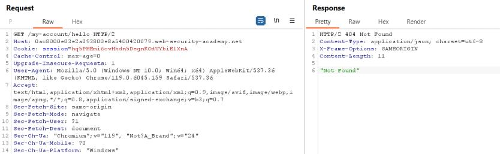
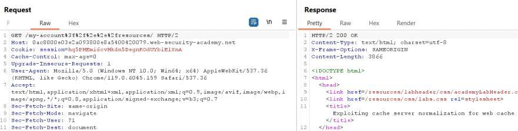
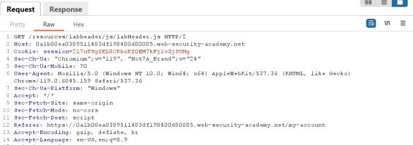
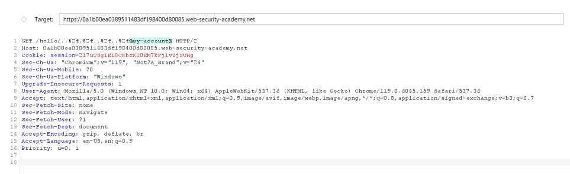

**Step1:**

First we login to account using given credential


We can see that an API key

**Step2:**


We can see in normal my-account request there is no cache header in reponce

i.e:
```
Cache-Control: max-age=30
Age: 0
X-Cache: miss
```

**Step3:**

As we in this lab we have to exploit path mapping so When we append my-account with /hello.js we have cache header in response


This is because cache is configured to store responses for requests where the path ends in .js, it would cache and serve the profile information as if it were a js file


**Step4:**

Now we have to find the api key for the use carlos for this so we craft the url like
https://0abf00630369970480740dec00920078.web-security-academy.net/my-account/hello1new.js

We store it in exploit server with in window.location and send it to victim


Store it and deliver it to victim

When the user access the link it will cache the user api key when we access the URL like in a new tab the carlos user api key


Submit the API key as an answer to solve the lab


**Step1:**

First we login with the given credential. 


**Step2:**

When we send the my-account request to repeater


Here we can see no cache header in response

But when we append the api endpoint with /<anything> it show not found so path mapping will not work. 


**Step3:**

It is clear that we use delimiter here but we not know which delimited is used here for this we use lit provided in challenge

First send the request to intruder


Add a position for payload and in payload setting paste the copy payload list


At the bottom of page we have


Turn of this


Start attack… we see only 2 delimiter is supported


**Step4:**

Use them as a delimiter. When we use ? We have 200 but no cache header


When we append .js still no cache header


But when we use ; as a delimiter


**Step5:**

Send the request to carlos user using 
```
<script>document.location="https://0a8b006c04093d4b8101b144009100a5.web-security-academy.net/my-account;helloworld.js"</script>
```

When we access the url we have


Submit the api key to solve the lab


**Step1:**

Login with given credential


**Step2:**

Send the my-account request to repeater

When we append endpoint with /hello it show not found


First we find the delimited using the list provided in the lab

Send the request to repeater


In payload setting we have

Add a position for payload and in payload setting paste the copy payload list


At the bottom of page we have


Turn of this


Start attack… we see only 1 delimiter is supported


When we send the request we have 200 okay


Changing hello to hello.js 


Here we can see no cache header 

**Step4:**

Now we check the static first we send the  /resources/js/tracking.js  to repeater we have


When we add ..%2f like /resources/..%2fjs/tracking.js we have not found error but cache is still supported


Now we have to work with my-account endpoint because we want carlos api key now when we append / resources with ..%2fmy-account we have cache header supported with ok response


**Step5:**

Now we try cache busting to send a different request to carlos. So we use delimiter

First request


Again send the request we have


**Step6:**

Now we send this request to end user with cache busting 

```
<script>document.location="https://0ae6004103de88dc80821ce300e500d3.web-security-academy.net/resources/..%2fmy-account?hello=nothing"</script>
```
But it is not working when I remove value then it is working

```
<script>document.location="https://0ae6004103de88dc80821ce300e500d3.web-security-academy.net/resources/..%2fmy-account?hello"</script>
```

Store it and deliver it to carlos


When I access this from url 


We have carlos api key


Submit the answer to solve this lab


**Step1:**

Login with given credential


**Step2:**

Send the my-account request to repeater


Append /hello with /my-account



Here it is clear that / is not treated as delimiter secondly is hello is not treated as a static file when we extend it with .js

Using intruder to find the delimiter from given list

In payload setting we have

Add a position for payload and in payload setting paste the copy payload list


At the bottom of page we have


Turn of this


Start attack… we see 4 delimiter is supported


Check the delimiter ? And it is working as seen earlier


**Step:**

Add a traversal before my-account


Here it is not found secondly response is cache. Even when encode like


**Step3:**

Sending the resource file 


Now when we append same path before resource file it show not found but the response is cache


Remove js/tracking.js because it is of no need


**Step4:**

Here when we replace my-account with my-account endpoint and encode /../ we can see 200 ok response. With a delimiter ? Is used


But here is one problem that response is not cache

We try other delimiter which show 200 okay response
Delimter #


Delimiter %23


Delimiter %3f



Form the above response it is clear that only # and %23 cache response

**Step5:**

we are at the phase of exploitation now we check any cache buster to make a chage response for victim try with delimiter


Second time send


So we send this script to use

```
<script>document.location="https://0ac8000e03e2a093800e8a5400420079.web-security-academy.net/my-account%23%2f%2e%2e%2fresources?hello1"</script>
```

I also try with # delimiter
```
<script>document.location="https://0ac8000e03e2a093800e8a5400420079.web-security-academy.net/my-account#%2f%2e%2e%2fresources?hello2"</script>
```

But this is not working


Now when we type the url in new tab we have carlos user api key


**Step1:**

Login with given credential


Send the request to repeater 


Here we can see there is no cache support for this request.

Now we append `/<anything` with request and send the request we can see in response not found 404


First we find the supported delimiter. Send the request to intruder and select the / and try list of delimiter provided in lab list


Payload setting

Add a position for payload and in payload setting paste the copy payload list


At the bottom of page we have


Turn of this


In response we can see only 2 delimiter are supported.


**Step3:**

Try these delimiter


We can see we have ok response but no cache header supported
Same is in the result given below


**Step4:**

Now we add a directory followed by my-account endpoint


Let's send another file and check if it returns a cached response, like /resources/labheader/js/labHeader.js



We have response have no cache supported header


**Step4:**

Now we find the file being cache like index.html or .htaccess for this we use a list of common  file

Send the /hello/..%2f.%2f..%2f..%2fmy-account request to intruder



Select the my-account and try the list of common file

Payload setting


We can see in response when we sort length we have two file is support cache  i.e robots.txt and favicon.ico


We can clear see in robot.txt and favicon.ico response is not found but cache

Same is for favicon.ico


**Step6:**

Now to have 200 okay response and response should also be cache we try delimiter ?


Here we have 200 but no cache header in responce

Lets try with ;


Same result is with robots.txt


**Step7:**

Now we have to find the cache buster for this we append ?<anything> with favicon.ico


Here I noticed when I change the cachebusting it not affect the response.I mean cache hit or miss.

But when I try it with robots.txt it works

First request


Again send the request


**Step8:**

Simply copy the url add add it in script but we encode .. So /../../../../ look like
`%2f%2e%2e%2f%2e%2e%2f%2e%2e%2f`

Before encoding we have

`https://0a1b00ea0389511483df198400d80085.web-security-academy.net/my-account;..%2f.%2f..%2f..%2frobots.txt?cacheBusting`

After encoding we have
```
https://0a1b00ea0389511483df198400d80085.web-security-academy.net/my-account;%2f%2e%2e%2f%2e%2e%2f%2e%2e%2f%2e%2e%2frobots.txt?cacheBusting5
```

Final script look like
```
<script>document.location="https://0a1b00ea0389511483df198400d80085.web-security-academy.net/my-account;%2f%2e%2e%2f%2e%2e%2f%2e%2e%2f%2e%2e%2frobots.txt?cacheBusting5"</script>
```

Now we store it and deliver it to victim


When I paste url in new window it will redirect to login page


So we get the csrf token for user admin for this 

Now we change cache busting again and store and deliver it to victim again

And in repeater  send the below request in repeater 

So this in 20 to 30 second


We can see a csrf token of administrator account is present

**Step9:**

Now we have to change the email for these first we change our email and send the //my-account/change-email to repeater

Replace the csrf with csrf of above reponse and change email


Now right click -> entension-> csrf poc generator and generate a proof of concept for this request

It look like


If you have no crst you can juy copy the below code and replace csrf value with your 
```html
<html>
  <!-- CSRF PoC - generated by Burp Suite Professional -->
  <body>
    <form action="https://0a1b00ea0389511483df198400d80085.web-security-academy.net/my-account/change-email" method="POST">
      <input type="hidden" name="email" value="i&#95;am&#95;admin&#64;admin&#46;com" />
      <input type="hidden" name="csrf" value="cXVxuNNK9lQniEV9MHoBXnH5WN7byec5" />
      <input type="submit" value="Submit request" />
    </form>
    <script>
      history.pushState('', '', '/');
      document.forms[0].submit();
    </script>
  </body>
</html>
```

Copy this and send to victim through exploit server


And store and deliver it to victim. And the lab is solved


